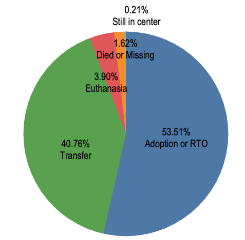
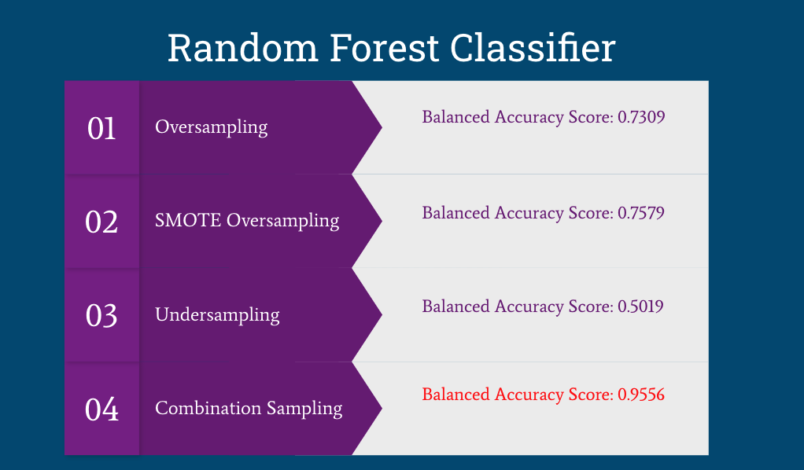
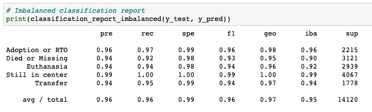

# Animal Shelter Analysis 
## The overview of the project
- Reson why I selected this topic: I have a cat named Frederick, whom I adopted from the local shelter. Ever since, I have been interested in animals in the shelter so I wanted to check if I can find the trends of animals entering and leaving the shelter.

- The source of data: I found a data from Austin Animal Center on Kaggle related to shelter animals, which contained data on animals at the center. However, the data was large and messy. For example, dog breeds spanned across thousands of different breeds. Since the data on cats was the least messy, I decided to focus on cat data from 2014 to 2020 for this analysis.
https://www.kaggle.com/datasets/jackdaoud/animal-shelter-analytics

- Questions I hope to answer with the data: With this dataset, I want to create various visualizations to show the different trends of cats at the shelter, like trends of cats entering and leaving the shelter. I also want to find a best machine learning model to predict the outcome status of the cats based on other factors -- adopted or returned to owner, died or missing, euthanized, still in center, or transferred to other centers.

- Data exploration phase 
1) Download Austin_Animal_Center_Intakes.csv file and Austin_Animal_Center_Outcomes.csv file from Kaggle.
2) Clean both files using Pandas and save them as clean_intakes.csv and clean_outcomes.csv accordingly.
3) Create tables for intakes and outcomes and join two tables to create one table in SQL.
4) Connect SQL to Pandas and clean intakes_outcomes table using Pandas and save it as clean_data.

- The analysis phase of the project
1) With clean data, find: total number of cats entering the shelter each year, average number of cats entering the shelter each year, a month when most number of cats entered the shelter each year, and a month when least number of cats entered the shelter each year.
(Analysis/Cat_Intakes_Analysis.ipynb)
2) Create pie charts for outcome types, intake types, intake conditions, and top 5 breeds using Tableau.
3) Create line graphs to show the number of cats entering the shelter by month and year using Tableau.
4) Create bar graphs to compare the outcome types for healthy cats and sick cats.
5) Create bar graphs to compare the average days that healthy cats and sick cats stayed in the center. 

- Technologies, languages, tools, and algorithms used throughout the project: Pandas, pgAdmin, PostgreSQL, random forest classifier, resampling techniques, and Tableau

## Machine Learning Model
- The random forest classifier was used to predict the outcome status of the cats based on other factors -- adopted or returned to owner, died or missing, euthanized, still in center, or transferred to other centers. I chose the random forest classifier because my dataset was large and had multiple input variables. However, the classes in a dataset were heavily imbalanced as below.

Since the imbalanced dataset can cause the models to be biased toward the majority classes, "Adoption or RTO" or "Transfer", I tried some sampling techniques -- random oversampling, SMOTE oversampling, undersampling, and SMOTEENN (combination sampling) to resolve the class imbalance.
- The preprocessing was required before running the models. First, I dropped unnecessary columns -- animal_id (unique IDs), animal_type (all were cats), and intake_date & outcome_date (duplicate data). Second, I encoded by converting the text features (intake_type, intake_condition, sex_upon_intake, and breed) into numerical data. 
- The target was outcome_type and the features were everything except outcome_type (intake_type, intake_condition, sex_upon_intake, age_upon_intake, breed, age_upon_outcome, and days_in_center).
- By default, I used the 75-25 split for the datasets.

## Results

- Imbalanced classification report for SMOTEENN (Combination Sampling) 

- As shown on the above, the combination sampling(SMOTEENN) generated the highest accuracy score, around 95.56%. The precision, recall, and F1 score were also high (>90%) for all classes, which indicates that the random forest classifier with combination sampling technique worked great at classifying the outcome types of cats in the shelter. 

## Presentation
- [Good Slides Link](https://docs.google.com/presentation/d/1A72A7Gl3RN6CEYklB8U5xz4t4mKqKVAY3215mDiSwmc/edit#slide=id.p)
- [Tableau Dashboard Link](https://public.tableau.com/app/profile/ayoung.kim2278/viz/Animal_center_analysis_Story/AustinAnimalCenterAnalysisCat)

## Recommendation for future analysis
- I recommend creating a machine learning model to predict how many animals will enter the shelter in the future.

## Anything I would have done differently
- I focused on the cats for this analysis beacuase the data was less messy. If the data for dogs wasn't as messy as it is right now and did not require tons of data cleaning then I would have analyzed both dogs and cats and show more insights related to dogs and cats.

